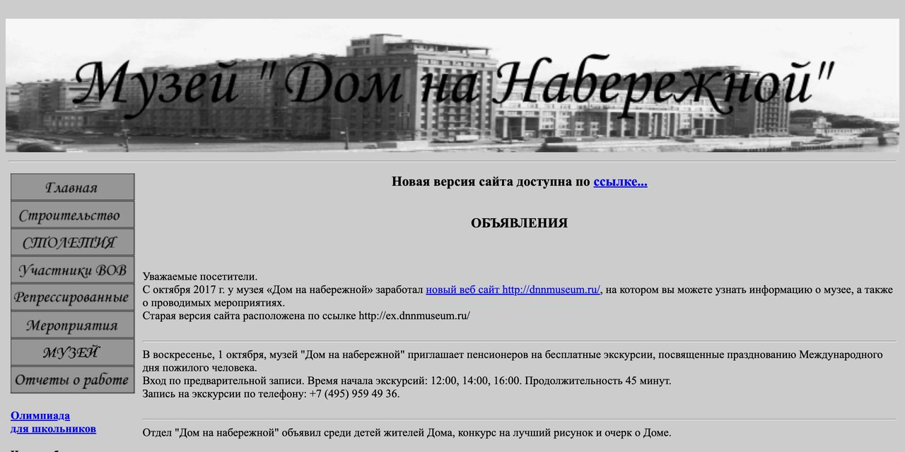

# Музей «Дом на набережной» — ранний сайт

*The House on the Embankment Museum — early website*

Первая версия сайта музея «Дом на набережной», созданная до того, как музей вошёл в состав Музея истории ГУЛАГа.

**[Открыть архив →](https://ex.dnnmuseum.gulagmemory.org)** · [Все сохранённые сайты](https://gulagmemory.org)

| | |
|:--|:--|
| **Тип** | Сайт музея |
| **Годы** | до 2017 |
| **Исходный адрес** | `ex.dnnmuseum.ru` |
| **Адрес архива** | [ex.dnnmuseum.gulagmemory.org](https://ex.dnnmuseum.gulagmemory.org) |
| **Снимок сделан** | февраль 2026 · статический снимок |

## О проекте

Сайт отражает работу музея в годы, когда его директором была Ольга Романовна Трифонова, вдова писателя Юрия Трифонова, чья повесть «Дом на набережной» дала дому его имя. Здесь собраны очерки об истории строительства Дома ЦИК и СНК, биографии жителей, материалы об архитекторе Борисе Иофане и постоянной экспозиции.

Более поздняя версия сайта (2017–2025) сохранена в репозитории [dnnmuseum.ru](https://github.com/gulag-museum/dnnmuseum.ru).

## Что сохранено

- история строительства дома;
- биографии жителей;
- страницы о Борисе Иофане и экспозиции музея;
- альбом «Дом на набережной» (составитель О. Р. Трифонова), постранично.

## Что не работает

- часть интерактивных элементов может не работать.

---

Репозиторий входит в [реестр сохранённых сайтов Музея истории ГУЛАГа](https://gulagmemory.org) — некоммерческий архив цифрового наследия, созданный в исследовательских и образовательных целях. Права на тексты, фотографии, видео и другие материалы принадлежат их авторам и правообладателям.

<b>English</b>

### The House on the Embankment Museum — early website

Early version of the House on the Embankment Museum website, from before the museum joined the GULAG History Museum in 2017: history of the building, biographies of residents, pages on architect Boris Iofan, and the photo album compiled by Olga Trifonova.

**Type:** Museum website · **Original address:** `ex.dnnmuseum.ru` · **Archive:** [ex.dnnmuseum.gulagmemory.org](https://ex.dnnmuseum.gulagmemory.org)

Part of the [registry of preserved GULAG History Museum websites](https://gulagmemory.org) — a non-commercial digital heritage archive for research and education. All texts, photographs, video and other materials remain the property of their authors and rights holders.

